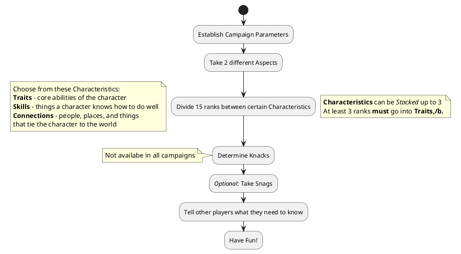

# Character Creation Summary

To create a character:

1. **Character Concept and Aspects**: Come up with and discuss your character concept during [Session Zero](SessionZero.md). Select two different [Aspects](Aspects.md) related to this concept.
2. **Baseline Characteristics**: Distribute 15 ranks between [Traits](Traits.md), [Skills](Skills.md), and [Connections](Connections.md). You cannot have more than 3 [Stack](Stack.md) in any one [Characteristic](Characteristic.md) at this point, and you must spend at least 3 ranks in Traits. If you have a Stack of 3 in a Skill, select a free [Focus](Foci.md).
3. **Knacks**: If your campaign has them, you should discuss your [Knack](Knacks.md) with the GM and the other players. Each Special Ability is defined individually, so work together to make something everyone will enjoy having in the game.
4. **Snags (optional)**: Add [Snags](Snags.md) to the character.
5. **Adjustment**: At this point, you gain 5 [Improvements](Improvement.md) to use as you like

