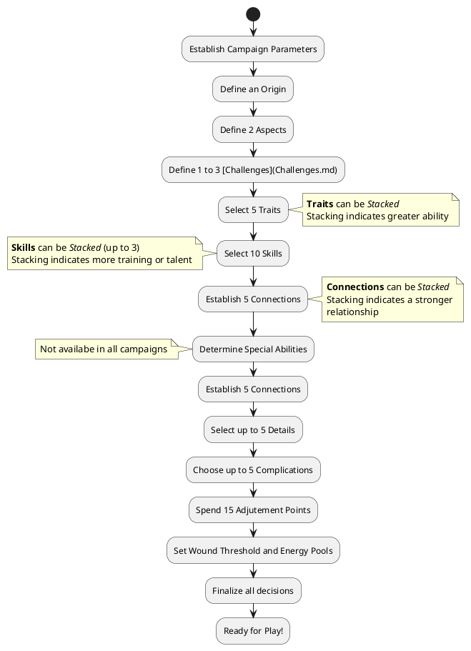

# Character Creation Summary

To create a character:

1. **Character Concept and Origin**: Come up with and discuss your character concept during [Session Zero](SessionZero.md). Determine your character's [Origin](Origin.md) now.
2. **Aspects**: Take two [Aspects](Aspects.md) that help define your character in a broad sense
3. **Traits**: Select five [Traits](Traits.md) that reflect your characters individual strengths; you can select the same Trait more than once
4. **Skills**: Select five [Skills](Skills.md); each skill gets a free Focus. You can select the same Skill more than once
5. **Connections**: Establish five [Connections](Connections.md); if you can share a connection with or have a connection to another player's character, so much the better.
6. **Special Abilities**: If your campaign has them, discuss and define the Scope and Magisterium of your character's [Special Ability](SpecialAbilities.md). If possible, the Special Ability should be tied into the character's [Origin](Origin.md). This may also add [Energy Pools](Energy.md).
7. **Details**: Select up to 5 [Details](Details.md) to round out your character
8. **Complications**: Choose up to 5 [Complications](Complications.md) for the character. The first two provide 2 Adjustment Points each, the next three provide 1 Adjustment Point each.
9. **Adjustment Points**: Spend 15 [Adjustment Points](AdjustmentPoints.md) to flesh out the character
10. **Final Notes**: Finalize your character's background. Set your final [Wound Threshold](WoundThreshold.md)/[Energy Pools](Energy.md) and make sure you haven't forgotten anything. Have fun!

