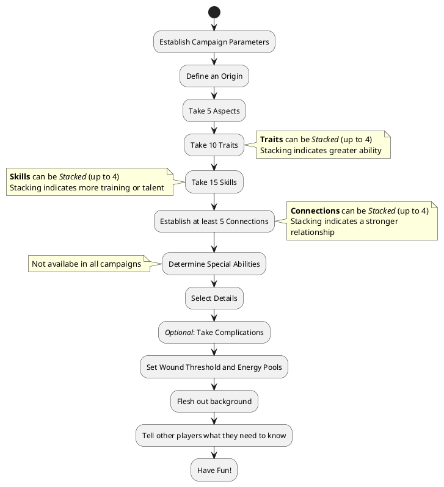

# Character Creation Summary

To create a character:

1. **Character Concept and Origin**: Come up with and discuss your character concept during [Session Zero](SessionZero.md). Determine your character's [Origin](Origin.md) now.
2. **Aspects**: Take Five [Aspects](Aspects.md) that help define your character in a broad sense. You can take the same Aspect more than once, but you must have at least two different Aspects.
3. **Traits**: Select 10 [Traits](Traits.md) that reflect your characters individual strengths; you can select the same Trait more than once, but cannot select the same Trait more than 4 times.
4. **Skills**: Select 15 [Skills](Skills.md); You can select the same skill more than once to increase its stack up to 4, or to add a Focus.
5. **Connections**: Establish at least 5 [Connections](Connections.md); if you can share a connection with or have a connection to another player's character, so much the better. Connections often have a stack higher than one.
6. **Special Abilities**: If your campaign has them, you should discuss your [Special Ability](SpecialAbilities.md) with the GM and the other players. Each Special Ability is defined individually, so work together to make something everyone will enjoy having in the game.
7. **Details**: Select several [Details](Details.md) to round out your character
8. **Complications**: Optionally, you may add [Complications](Complications.md) to the character. Although not required, these provide opportunities to gain [Perks](Perks.md), [Drama Dice](DramaDice.md), and bonus [Adjustment Points](AdjustmentPoints.md).
9.  **Final Notes** - *Before Session 1*: Finalize your character's background and expand on it as far as you'd like. Tell players whose characters have connections to your character stuff they should know about your character. Make sure you haven't forgotten anything. Have fun!

