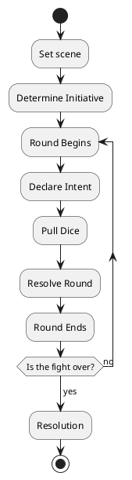

# Combat

I'm going to be upfront with you - when it comes to RPG design, making combat fun is where I have the least confidence. Any and all ideas and feedback are welcome.

## General Principles

The unnamed System uses a battle map for any full-scale combat. Minor skirmishes, on the other hand (any fight that should be resolved within a minute or so) are handled with an exchange of skill checks.

This means that there are two kinds of combat - Descriptive or Quick Engagements and Full Engagements. Each use their own rules and are designed for different circumstances.

## Quick Engagement

In movies, comics, and anime, there are frequently scenes, usually when the heroes are running down a corridor, when they briefly exchange fire/clash swords/whatever with some low-level thugs, robot gun turrets, and so on. 

These scenes provide a quick flash of action, but don't last long, and seldom result in injury to the protagonists. These are Quick Engagements.

A Quick Engagement doesn't require a battle map, and is resolved with some quick description a a couple throws of the dice, usually a single exchange between the players and their opponents. Use the following steps:

1. **The GM sets the scene**: As you rush down the corridor, four turrets pop out of the ceiling and open fire!
2. **The Players react**: "I throw myself to the ground!" "I dive behind Bob and fire from under his arm!" "I open up with my Gatling gun!"
3. **Everyone Rolls**: Player pull their dice pools together, and the GM rolls a number of dice based on the difficulty of the encounter (starting at 2 per player, up to 5 per player; anything bigger probably needs a Full Engagement).
   1. If the players get more successes than the GM, they win the encounter, describe their victory, and continue
   2. If the GM gets more successes, the players don't win; describe what happens, the GM's dice pool is reduced by 1 per player, then go back to Step 2
   3. If no one rolls any successes or there's a tie, something weird happens; an unexpected intervention, the conditions change, or anything else that makes things... well, not necessarily better or worse, just *different*.
   4. If one of the players rolls a Disaster (see [Core Rules](HBCore.md)), they loose [resources](YourStuff.md), take a [wound](WoundThreshold.md), or must [Burn](Burn.md) a Characteristic (usually an [Aspect](Aspects.md) or [Trait](Traits.md)) - whatever is appropriate

   And that's it - once the players get more successes than their opponents, you move on. You can take as much time with descriptions and such as you want, and players can use [Special Abilities](SpecialAbilities.md) freely - they only lose resources or [Energy](Energy.md) if they throw a Disaster.

   Players can, of course, burn their Traits and so on if they like, but the whole idea is a quick, fun action scene where the players can show off a little with minimal risk on their way to something bigger - a big RP opportunity, or maybe a Full Engagement.

## Full Engagement

Full Engagements are for things like BBGs and their lieutenants or other bigger events.

The idea here is to make it so that everyone has something interesting to do every round, and to make every round engaging for every player. Teamwork, maneuvering, and tactics are all important.

### Full Engagement Chart

A Full Engagement round follows the following structure:

## Set Scene

Everything starts with the GM setting the scene, describing the area and situation. Set up a battlemap, assign miniatures to those involved, and get things rolling.

### Battlemaps

The battlemap is just a way to keep track of where everyone is in relation to each other, and where people are in relation to effects or events that take place over an area (Area Effects).

This document refers to distances in "squares", referencing a 1 inch or 2 cm square grid, with each square usually representing 2 yards or 2 meters. That doesn't mean you have to use a square grid, though; there's nothing in the system that requires it. You can just as easily use a hex grid or even just measure distances as you would with wargaming miniatures. "Squares" is just a handy reference term.

You also don't have to use a battlemap at all, if you can keep track of things in your head. Theater of the Mind battles are fine, and there's nothing in the rules here that specifically requires a map. A battlemap can help to end arguments about positioning before they start, and are a useful visualization tool, but they're not required.

## Determine Initiative

The unnamed System divides turn order into groups depending on who is participating in the combat. Each "side" of the battle gets a turn. So if the players are together and fighting a single opposing force, the players get a turn and the enemies get a turn.

Initiative for a group is usually determined by common sense, favoring the players. If it makes more sense for the opponents to go first, however, they go first.

If you want to make it more random or divide up turns per player, players should pull dice for a roll. Instead of counting successes, however, you total the dice, with highest going first. The GM should roll the largest [dice pool](NPCs.md) among the NPCs.

## Round Begins

A round is divided into four parts: Declaration, Pull Dice, Resolution, and End. During each phase. all players get one (or possibly more) Actions - things they can do. What a player can do depends on the phase:

- **Declaration**: Players declare their intents for the round, describing what they want to accomplish
- **Pull Dice**: Players pull dice for the actions they intend to take. Players may only pull an individual resource once in a round unless they [Burn](Burn.md) it.
- **Resolution**: Players and GM roll dice and compare results. This isn't a contest like the Quick Engagement; see below.
- **End**: Based on Resolution, describe what happens and make sure everyone is where they need to be for the next round. End of Round effects resolve/end.

If, after the End Round step, there is no longer a battle to be had (all but one side is dead/unconscious/captured/has escaped, or all sides want to quit), then combat is over. Otherwise, return to Declaration and keep going.

### Declare Intent

Each round represents five to ten seconds of time (sometimes longer). During declaration, you can generally say you're doing anything that can be accomplished within that timeframe.

Character actions aren't divided into discrete actions as they are in many other games; instead, the players discuss their tactics and declare what they intend to do. As long as it's reasonable that the characters can do what they're trying to do in five to ten seconds, everything's fine.

**Example:** *Kara intents on providing covering fire for Jake while he tries to close with the vampire. Once Jake gets to the vampire, he wants to do a takedown move and attempt to stake him, while Kara turns her attention to providing suppressing fire to keep the vampire's minions away.*

#### Intent Guidelines

- A character can move about 6 squares (12 yards/meters) easily (there's some wiggle room there depending on what else you're trying to do). Moving further may have consequences - you might be easier to hit, or have to make a check, or lose dice on other checks you make
- Characters that have combat skills can usually make more attacks (depending on the weapon) than those who don't
- [Special Abilities](SpecialAbilities.md) may have limitations on usage within a round
- As you declare intents, keep in mind the rules below under Pull Dice. What you do limits what else you can do in a round.

### Pull Dice

Once intent is declared, players pull the dice pools they'll need for the round. You may only use a given [Trait](Traits.md) or [Aspect](Aspects.md) once in a round unless you Burn it; Characteristics that are Burned can be used again, or can be used before they're burned.

[Skills](Skills.md), on the other hand, can be used as many times in a rounds as is appropriate.

### Resolve Round

## End of Round

### Victory?

## Resolution
